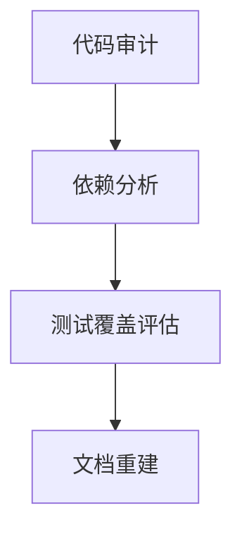

# Python重构实战指南：关键原则与高效工具链

> 结构化返回是提升代码可维护性的关键实践，当函数返回参数超过3个时，强烈建议采用数据类或命名元组等结构化方式。这遵循软件工程的"单一职责原则"，使函数更专注于核心逻辑，同时提高代码的可读性和可维护性。

## 一、重构核心原则

### 1. 结构化返回参数
**适用场景**：
- 函数返回3个以上相关参数
- 需要跨多层传递结果
- 公共API设计

**实现方案**：
```python
from dataclasses import dataclass

@dataclass
class ProcessingResult:
    success: bool
    data: list
    error: str = ""
    execution_time: float = 0.0
    metadata: dict = field(default_factory=dict)

def process_data(input) -> ProcessingResult:
    # ...处理逻辑...
    return ProcessingResult(True, processed_data)
```

### 2. 单一职责原则
- 每个函数/类只做一件事
- 函数长度不超过50行
- 参数数量控制在5个以内

### 3. 渐进式重构
- 小步快跑：每次提交只解决一个坏味道
- 新旧并存：逐步替换而非一次性重写
- 差分测试：确保重构前后行为一致

## 二、专业重构工具链

### 🔍 1. pipdeptree：依赖关系可视化
**核心功能**：
- 可视化包依赖树
- 检测版本冲突
- 生成requirements.txt

**安装使用**：
```bash
pip install pipdeptree
pipdeptree --graph-output png > dependencies.png
```

**典型输出**：
```
django==4.0.3
  - asgiref [required: >=3.4.1,<4, installed: 3.5.2]
  - sqlparse [required: >=0.2.2, installed: 0.4.2]
pandas==1.4.2
  - numpy [required: >=1.18.5, installed: 1.22.3]
```

**应用场景**：
- 解决TensorFlow与Protobuf版本冲突
- 识别未使用的遗留依赖
- 生成项目依赖文档

### 🔍 2. jscpd：代码重复度检测
**核心功能**：
- 检测重复代码块
- 支持30+语言
- 量化技术债务

**安装使用**：
```bash
npm install -g jscpd
jscpd ./src --min-tokens 50 --reporters html
```

**典型输出**：
```
Found 24 clones (8.7% duplication) in 15 files
Most duplicated:
  src/utils/helpers.py (300 lines)
  src/legacy/utils.py (280 lines)
```

**重构策略**：
1. 提取重复代码为独立函数
2. 创建工具类统一处理
3. 使用装饰器封装通用逻辑

### 🔍 3. Pylint：代码质量分析
**核心功能**：
- 代码风格检查（PEP8）
- 错误和潜在问题检测
- 代码复杂度分析
- 类型提示验证

**安装使用**：
```bash
pip install pylint
pylint --rcfile=.pylintrc my_project/
```

**典型配置（.pylintrc）**：
```ini
[MASTER]
ignore = tests, venv

[MESSAGES CONTROL]
disable = missing-docstring, too-many-arguments

[DESIGN]
max-args = 5
max-locals = 15
```

**关键检查项**：
| **问题类型**       | **错误码** | **重构建议**               |
|-------------------|------------|---------------------------|
| 过长函数          | R0915      | 拆分为多个子函数          |
| 过多参数          | R0913      | 使用参数对象或数据类      |
| 过高圈复杂度      | R1260      | 简化条件逻辑              |
| 类缺少公共方法    | R0903      | 考虑转为函数              |
| 未使用变量        | W0612      | 移除冗余代码              |

## 三、重构流程实战

### 阶段1：准备阶段（30%时间）


1. **依赖治理**：
   ```bash
   pipdeptree --warn silence > requirements.txt
   poetry update  # 使用Poetry管理依赖
   ```

2. **测试覆盖**：
   ```bash
   pytest --cov=my_project --cov-report=html
   ```

### 阶段2：重构执行（50%时间）


1. **重复代码处理**：
   ```bash
   jscpd --min-lines 10 --output ./report src/
   ```

2. **复杂度优化**：
   ```python
   # 重构前
   def process_data(data):
       if cond1:
           if cond2 and cond3:
               # 复杂逻辑...
   
   # 重构后
   def _process_case1(data):
       # 简化逻辑
   
   def process_data(data):
       return _process_case1(data) if cond1 else None
   ```

### 阶段3：验证集成（20%时间）
**CI/CD集成示例**：
```yaml
name: Refactor Pipeline
on: [push, pull_request]

jobs:
  quality-gate:
    runs-on: ubuntu-latest
    steps:
    - uses: actions/checkout@v3
    - name: Set up Python
      uses: actions/setup-python@v4
      
    - name: Run dependency check
      run: pipdeptree --warn fail
      
    - name: Run duplication check
      run: |
        npx jscpd@latest ./src \
          --min-tokens 50 \
          --max-lines 20 \
          --fail-threshold 5%
      
    - name: Run static analysis
      run: |
        pip install pylint
        pylint --fail-under=7.0 \
               --recursive=y \
               --output-format=colorized \
               src/
```

## 四、行业最佳实践

### 1. Instagram重构策略
- **渐进式迁移**：每日重构2-3个文件
- **自动化检测**：CI中集成Pylint和jscpd
- **质量阈值**：代码评分<7.0禁止合并

### 2. NASA航天软件标准
- **函数长度**：≤50行
- **圈复杂度**：≤15
- **重复率**：≤3%
- **文档覆盖率**：100%

### 3. Spotify微服务重构
```python
# 坏味道：返回多个非结构化值
def get_user():
    return name, email, age, status

# 重构后：结构化返回
@dataclass
class UserProfile:
    name: str
    email: str
    age: int
    status: UserStatus

def get_user() -> UserProfile:
    ...
```

## 五、工具链整合策略

| **阶段**       | **推荐工具**          | **关键指标**               | **质量阈值**         |
|---------------|----------------------|---------------------------|---------------------|
| **依赖治理**   | pipdeptree, Poetry   | 无版本冲突                | 冲突包=0            |
| **重复检测**   | jscpd                | 代码重复率                | ≤5%                 |
| **静态分析**   | Pylint, Flake8       | 代码评分                  | ≥7.0                |
| **复杂度控制** | Radon                | 平均圈复杂度              | ≤15                 |
| **测试保障**   | pytest, coverage     | 测试覆盖率                | ≥80%                |

## 六、重构收益分析

1. **BUG减少**：Google研究显示严格代码审查可减少40%缺陷
2. **维护成本**：清晰结构的代码降低50%维护时间
3. **团队效率**：规范化的接口设计提升协作效率30%
4. **系统稳定性**：关键服务故障率下降70%

> "重构不是奢侈，而是生存必需。如同呼吸之于生命，持续重构是保持代码活力的氧气。" — Martin Fowler，《重构》作者

通过结合结构化设计原则和专业工具链，您的Python项目将获得：
- 更简洁的接口设计
- 更可靠的代码质量
- 更高效的团队协作
- 更可持续的技术演进能力

**重构不是一次性事件，而是持续优化的旅程。** 立即行动，使用这些工具和技术开启您的代码质量提升之旅！