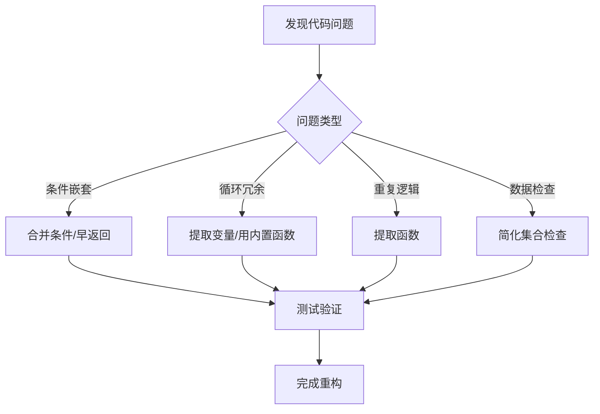

对于Python新手，除了使用重构工具外，以下简单易学的重构方法能显著提升代码质量，结合搜索结果中的实用技巧，归纳为五类核心方法并附代码示例：

---

### 🔍 一、简化条件表达式
1. **合并嵌套条件**  
   将多层嵌套的`if`合并为单层逻辑，减少缩进复杂度：  
   ```python
   # 重构前
   if a > 0:
       if b > 0:
           return a + b
   
   # 重构后
   if a > 0 and b > 0:  # 合并条件
       return a + b
   ```

2. **使用早返回（Guard Clauses）**  
   提前处理边界条件，减少主逻辑嵌套：  
   ```python
   # 重构前
   def process_data(data):
       if data is not None:
           # 复杂处理...
           return result
       else:
           return None
   
   # 重构后
   def process_data(data):
       if data is None:  # 边界提前返回
           return None
       # 主逻辑（无嵌套）
       return result
   ```

3. **替换条件表达式**  
   用三元表达式简化赋值逻辑：  
   ```python
   # 重构前
   if score >= 60:
       status = "Pass"
   else:
       status = "Fail"
   
   # 重构后
   status = "Pass" if score >= 60 else "Fail"  # 一行完成
   ```

---

### 🔄 二、优化循环与迭代
1. **提取循环内不变变量**  
   避免在循环内重复计算固定值：  
   ```python
   # 重构前
   for item in items:
       city = "London"  # 每次循环重复赋值
       process(item, city)
   
   # 重构后
   city = "London"  # 移出循环
   for item in items:
       process(item, city)
   ```

2. **用内置函数替代手动循环**  
   使用`any()`/`all()`简化存在性检查：  
   ```python
   # 重构前
   has_negative = False
   for n in numbers:
       if n < 0:
           has_negative = True
           break
   
   # 重构后
   has_negative = any(n < 0 for n in numbers)  # 一行替代循环
   ```

3. **优先使用生成器**  
   大数据处理时用生成器节省内存：  
   ```python
   # 列表推导式（立即加载）
   data = [x*2 for x in range(1000000)]  # 占用大量内存
   
   # 生成器表达式（惰性加载）
   data_gen = (x*2 for x in range(1000000))  # 动态生成值
   ```

---

### ⚙️ 三、避免重复与冗余
1. **消除重复计算**  
   缓存重复调用的结果：  
   ```python
   # 重构前
   for item in items:
       if len(item) > 5 and len(item) < 10:  # 重复调用len()
           ...
   
   # 重构后
   for item in items:
       item_len = len(item)  # 存储结果
       if item_len > 5 and item_len < 10:
           ...
   ```

2. **删除不必要的临时变量**  
   直接返回结果而非赋值后返回：  
   ```python
   # 重构前
   def get_user_info(user):
       info = {"name": user.name, "id": user.id}
       return info
   
   # 重构后
   def get_user_info(user):
       return {"name": user.name, "id": user.id}  # 直接返回
   ```

---

### 🧩 四、函数与逻辑提取
1. **分解复杂函数**  
   将大函数拆分为单一职责的小函数：  
   ```python
   # 重构前
   def process_order(order):
       if order.status != "paid":  # 验证
           raise Error("未支付")
       total = sum(item.price * item.quantity for item in order.items)  # 计算
       save_to_database(order)  # 存储
   
   # 重构后
   def validate_order(order): ...
   def calculate_total(order): ...
   def save_order(order): ...
   ```

2. **使用装饰器统一处理横切关注点**  
   用装饰器封装日志、权限等重复逻辑：  
   ```python
   def log_time(func):
       def wrapper(*args, **kwargs):
           start = time.time()
           result = func(*args, **kwargs)
           print(f"耗时：{time.time()-start:.2f}s")
           return result
       return wrapper
   
   @log_time  # 添加计时功能
   def heavy_calculation():
       ...
   ```

---

### 📦 五、数据结构优化
1. **简化集合存在性检查**  
   直接使用容器真值测试而非`len()`：  
   ```python
   # 重构前
   if len(user_list) > 0:
       send_notification(user_list)
   
   # 重构后
   if user_list:  # 空列表自动为False
       send_notification(user_list)
   ```

2. **用字典替代多层`if-else`**  
   映射关系更清晰：  
   ```python
   # 重构前
   if status == "success":
       handler = success_handler
   elif status == "fail":
       handler = fail_handler
   ...
   
   # 重构后
   handler_mapping = {
       "success": success_handler,
       "fail": fail_handler
   }
   handler = handler_mapping.get(status, default_handler)
   ```

---

### 💎 新手重构流程图


> “重构不是一次性事件，而是持续优化的旅程。小步快跑、及时验证，才能让代码优雅进化。” —— Martin Fowler《重构》核心理念

这些方法无需复杂工具，只需在编码时有意识地应用，即可显著提升代码可读性与健壮性。建议每次只专注1-2项技巧，逐步养成习惯。